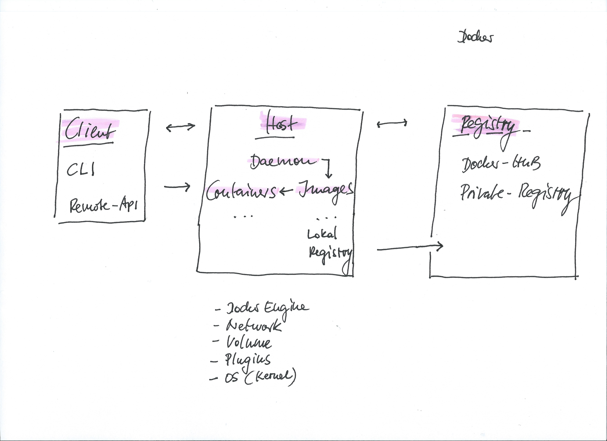

# Concepts & Architecture

**Pro**

- Single Deployment Unit
- Encapsulates
  - Application
  - Dependencies
  - Libraries
  - Binaries
  - Configuration files
- Immutable using stacked images
- Lightweight
- Fast
- Cost effective
- Enables Continuous Integration & Continuous Deployment
- Easy to integrate in Testing, Staging, Production

**Cons**

- Shared the kernel
- Less flexibility in operating systems
- The challenge is networking

## Docker Deamon

- Uses an "Execution Driver" `runc` to create Container
- Isolates Kernel-Features
  - cgroups for resource management
  - namespaces for container isolation
  - Union File System (UFS) for image file layers
- Server via tcp://, unix://, http://, https://

## Docker Client

- `docker`, `docker-machine` and every Docker-API client
- Consumer via tcp://, unix://, http://, https://
- Supports different **drivers** (VirtualBox, Digital Ocean, AWS, Azure, etc.)

### Docker Registry

- [Public Registry](https://hub.docker.com) - Public Image Registry
- [Private Registry](https://hub.docker.com/_/registry/) - On-Premise Image Registry

### Docker Images

- Images are Layers `docker history tutum/hello-world:latest`
- Every layer is (naive) cached (is in cache AND same command in stack)

### Docker Containers

- Run from [Base Images](https://hub.docker.com)
- Build from **Dockerfile** or **docker-compose.yml**

### TOOLS

- Kitematic - UI for Windows and OSX
- Compose - Build and Run multiple depended Containers
- Swarm - Service Orchestration
- Kubernetes - Service Orchestration
