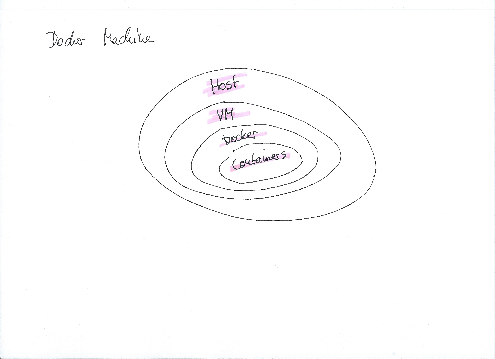

# Docker Machine

- Manage VMs
- CLI based
- Cloud-Enabled (Google, AWS, OpenStack, etc.)



**CLI** - `docker-machine --help`

- [Create VMs](#create-vms)
  - Local
  - Google Cloud
- [Set Environment](#set-environment)
- [SSH](#ssh)
- [Remove VMs](#remove-vms)

## Create VMs

### Local Driver

```bash
docker-machine create --driver virtualbox \
  workshop
```

```bash
eval $(docker-machine env workshop)
```

### Google Cloud Driver

1. [Create a Google Service Account](https://stackpointcloud.com/community/tutorial/google-compute-engine-setup-and-authentication)

Download to `$HOME/gce-credentials.json`.

```bash
export GOOGLE_APPLICATION_CREDENTIALS=$HOME/gce-credentials.json
```

2. Activate Google Cloud APIs (Google Compute Engine, Google Docker Registry)

3. [Configure Docker Machine](https://docs.docker.com/machine/drivers/gce/)

```bash
docker-machine create --driver google \
  --google-machine-type g1-small \
  --google-zone europe-west4-a \
  --google-project workshops-mikebild \
  workshop-01
```

## List

```bash
docker-machine ls
```

## Set Environment

```bash
eval $(docker-machine env workshop-01)
```

## SSH

```bash
docker-machine ssh workshop-01
```

## Remove VMs

```bash
docker-machine rm workshop-01
```

```bash
docker-machine rm workshop workshop-01
```
