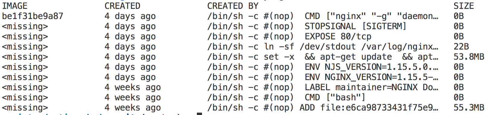

# Docker Images



- Immutable
- Layered on Base-Image
- Historical

- [Images](#images)
- [Remove Images](#remove-images)
- [Image History](#image-history)
- [Docker-Ignore](#docker-ignore)
- [Build and run your own container image](#build-and-run-your-own-container-image)
- [Create your own Docker-Registry](#create-your-own-docker-registry)
- [Tag and push a container image to a Docker-Registry](#tag-and-push-a-container-image-to-a-docker-registry)
- [More](#more)

## Images

```bash
docker images --all
```

## Remove images

```bash
docker rmi <name>/<id>
```

## Image History

```bash
docker history nginx
```

## Docker Ignore

_`.dockerignore`_

```txt
node_modules
npm-debug.log
```

## Build and run your own container image

**Build**

```bash
docker build -t nodejs-app:v1.0.0 $(pwd)/examples/nodejs-app
```

**Run**

```bash
docker run -d -e PORT=8080 -p 8080:8080 nodejs-app:v1.0.0
open http://<ip>:8080/api/todos
```

## Create your own Docker-Registry

- runs local or on-premise

```bash
docker run -d -p 5000:5000 --name registry registry:2
open http://<ip>:5000/v2/_catalog
```

## Tag and push a container image to a Docker-Registry

**Tag**

```bash
docker tag nodejs-app:v1.0.0 localhost:5000/nodejs-app:v1.0.0
```

**Push**

```bash
docker push localhost:5000/nodejs-app:v1.0.0
```

## More

### Delete dangling images

```bash
docker rmi $(docker images -q -f dangling=true)
```

### Delete all images

```bash
docker rmi $(docker images -q)
```
