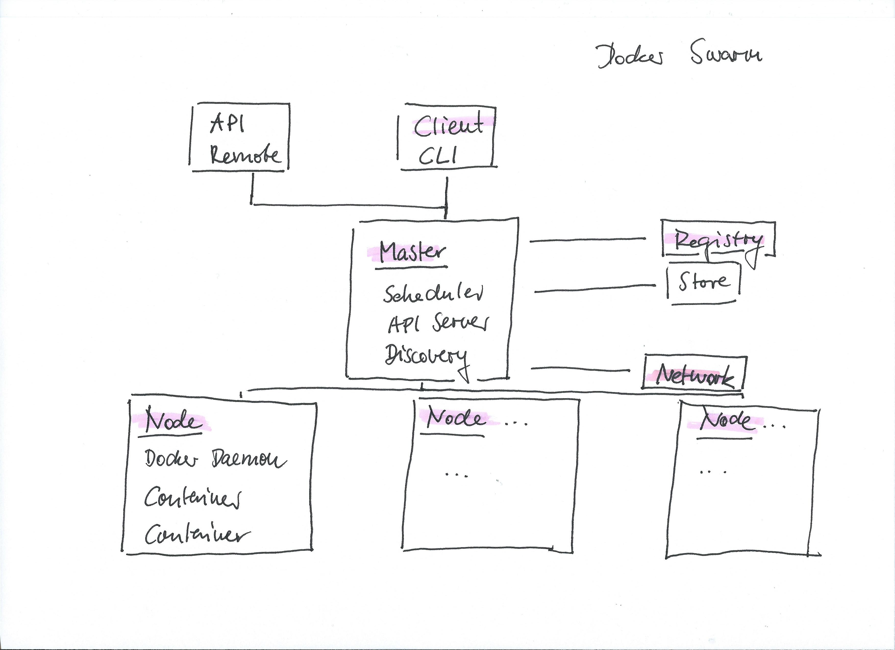

# Docker Swarm

- Spanning multiple Nodes as Node-Cluster (Raft-Protocol)
- Runs in front of API-Consumers e.g. CLI
- Service-Oriented Stacks
- Expose resources as **Services** via **Service-Discovery** (etcd)
- Maintain state of all containers
- Makes container schedule decisions



- [Setup](#setup)
- [Services and Stacks](#services-and-stacks)

## Setup

### Master

```bash
docker-machine create -d virtualbox --swarm --swarm-master master
docker-machine ssh master
docker swarm init --advertise-addr <eth-ip>
```

### Agent

```bash
docker-machine create -d virtualbox --swarm agent1
docker-machine ssh agent1
docker swarm join --token <token> <eth-ip>:2377
```

## Services and Stacks

### Set Master as active Machine

```bash
eval $(docker-machine env master)
```

### Stack Deployments using Docker-Compose

```bash
docker stack deploy -c $(pwd)/examples/compose-nodejs-redis/docker-compose.yml compose-nodejs-redis
```

### List Stacks

```bash
docker stack ls
```

### List Services

```bash
docker service ls
```

### Scale

```bash
docker service scale compose-nodejs-redis_web=2
```

### Remove

```bash
docker stack rm compose-nodejs-redis
```
